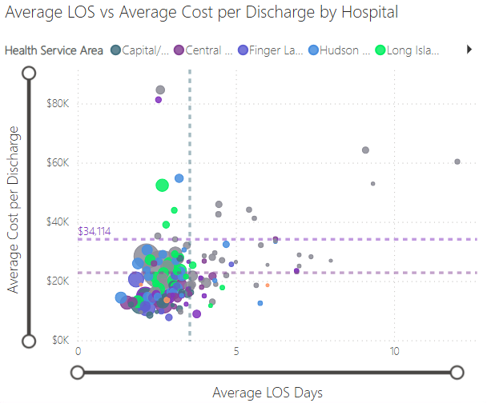
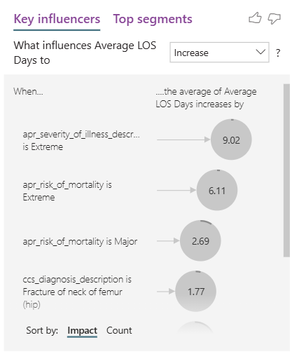
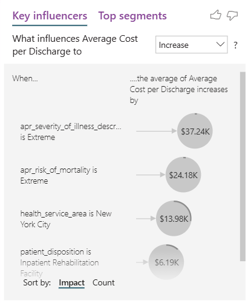
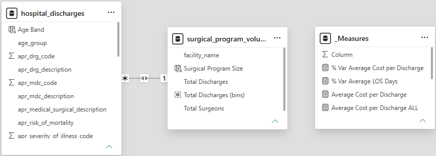
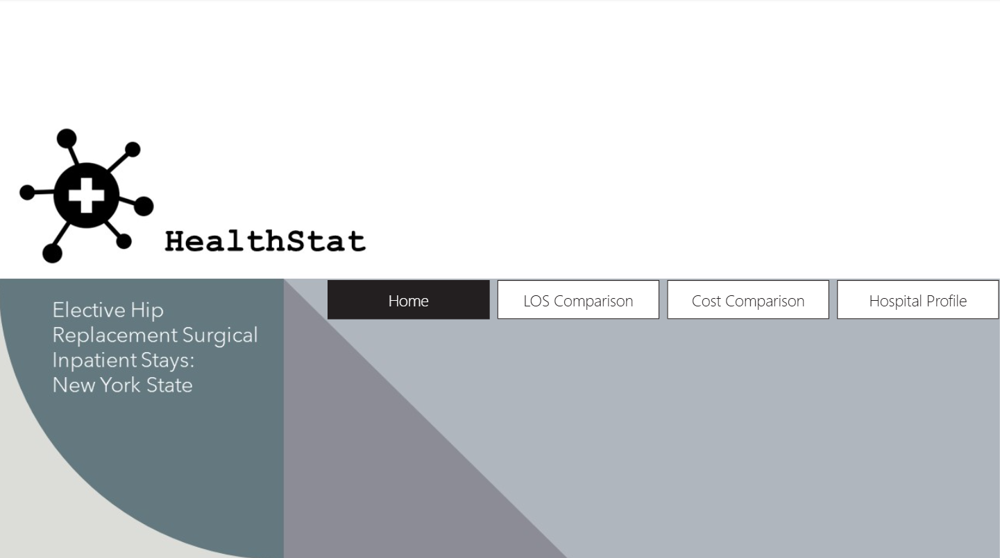
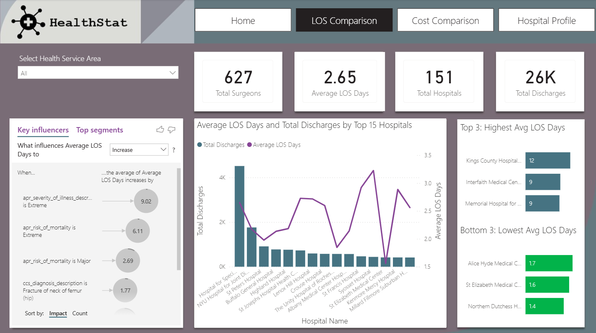
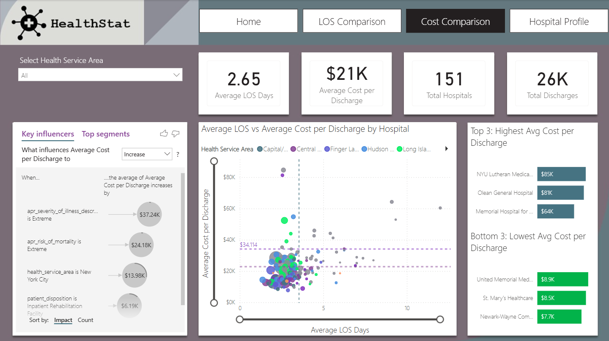
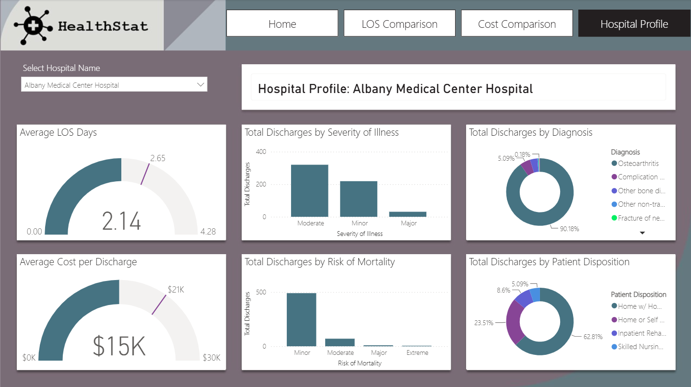

# Healthcare Hospital Operational Efficiency & Cost Analysis


[](https://app.powerbi.com/view?r=eyJrIjoiYWM1OTVkMDctYjI2NS00NjgwLThkYmItOWFlZDZmY2Y4ZmNjIiwidCI6IjRlMmY1NzE2LTk0ZDMtNGViMC1hZjIyLWI4OTljOTFmN2NkMyIsImMiOjEwfQ%3D%3D&pageName=b7bccb735e62d868e65c)

## 📌 Abstract
Healthcare systems operate under tight margins where clinical efficiency directly impacts patient capacity, care quality, and financial sustainability. This project delivers an executive business intelligence solution in **Power BI** for **HealthStat**, a healthcare consulting firm, evaluating hospital-level operational performance for elective hip replacement surgeries across New York State.

Analyzing **26,000+ patient discharges across 151 hospitals**, the project establishes performance benchmarks using **Length of Stay (LOS)** and **Average Cost per Discharge**. Utilizing advanced DAX calculations, dynamic outlier quadrant mapping, and AI-driven root cause modeling, the report identifies clinical and geographic cost drivers—revealing extreme disease severity, major mortality risks, and skilled nursing transfers as the core determinants of inpatient inefficiency.

---

## 📂 Data Ingestion & Preprocessing
The dataset comprises state-wide inpatient discharge records with 30 clinical, operational, and financial attributes.

### ETL & Transformation Pipeline (Power Query)
* **Cohort Filtering**: Filtered procedure descriptions to isolate elective `HIP REPLACEMENT, TOT/PRT` surgeries, ensuring clinical standardization.
* **Data Quality Profiling**: Inspected column quality, value distributions, and validated that records contained HIPAA-compliant, de-identified patient data.
* **Demographic Segmentation**: Engineered conditional logic to create an `Age Band` column (`Age 50+` vs. `Age <50`) to isolate target risk demographics.
* **Centralized Logic**: Isolated and organized all business measures inside a dedicated `_Measures` table.

---

## 📈 Exploratory Data Analysis & Business Insights
Multidimensional exploratory analysis was performed to benchmark hospitals against state-wide averages.

### 1. Hospital Outlier & Quadrant Analysis (Cost vs. LOS)


*Figure 1: Hospital Benchmarking — Average LOS vs. Average Cost per Discharge with 90th Percentile Cost Threshold.*

**Insight:** Statewide averages established a baseline of **2.65 days LOS** and **$20,910 cost per discharge**. Significant regional variability was identified, with facilities in New York City representing a disproportionate volume of 90th-percentile cost outliers.

### 2. Clinical Driver & Root Cause Analysis



*Figure 2: AI-Powered Key Influencer Analysis on Inpatient Length of Stay and Cost Drivers.*

**Insight:** AI visual modeling confirmed that clinical complexity is the primary driver of extended hospital stays. Patients categorized with **Extreme Severity of Illness** and **Major/Extreme Risk of Mortality** generated the highest upward variance in both stay duration and cost per discharge.

---

## 🧠 Data Model Architecture & DAX Formulas
To evaluate the impact of surgical scale, a summarized proxy table was integrated into the dimensional model using DAX.

* **Surgical Program Sizing**: Created a calculated table summarizing volume and surgeons by hospital using `SUMMARIZECOLUMNS()`, followed by grouping discharges into 200-procedure bin increments (`< 200`, `200 - 399`, `400 - 599`, `>= 600`).
* **Dynamic Reporting Titles**: Bound card visual headers dynamically to slicer selections via `VALUES()`.



*Figure 3: Healthcare Data Model Schema and Summarized Program Volume Relationships.*

### Core DAX Measures

```dax
// Total Discharges
Total Discharges = 
COUNTROWS(hospital_discharges)

// Total Hospitals
Total Hospitals = 
DISTINCTCOUNT(hospital_discharges[facility_id])

// Average Length of Stay (Days)
Average LOS Days = 
AVERAGE(hospital_discharges[length_of_stay])

// Average Cost per Discharge
Average Cost Per Discharge = 
DIVIDE(
    SUM(hospital_discharges[total_costs]), 
    [Total Discharges], 
    0
)

// Variance vs. State Average Cost
% Var Average Cost per Discharge = 
DIVIDE(
    [Average Cost Per Discharge] - [Average Cost per Discharge ALL],
    [Average Cost per Discharge ALL],
    0
)

// Variance vs. State Average LOS Days
% Var Average LOS Days = 
DIVIDE(
    [Average LOS Days] - [Average LOS Days ALL],
    [Average LOS Days ALL],
    0
)

// Dynamic Facility Title
Title Selected Facility = 
"Hospital Profile: " & VALUES(hospital_discharges[facility_name])
```

---

## 📊 Dashboard Architecture & AI Capabilities

| Page / Feature | Architecture | Core Functionality |
| :--- | :--- | :--- |
| **Home Navigation** | Landing Page Portal | Branded interface with centralized button navigator to direct user flow across reporting modules. |
| **LOS Comparison** | Operational Benchmarking | Line and stacked column charts tracking volume vs. LOS, Top/Bottom 3 hospital rankings, and stay duration KPIs. |
| **Cost Comparison** | Financial Outlier Dashboard | Dynamic scatter plot with 90th percentile cost lines, % variance tables with conditional formatting, and cost driver summaries. |
| **Hospital Profile** | Deep-Dive Facility View | Gauge tracking against state targets, mortality/severity breakdown, and disposition analysis for individual hospitals. |

---

## 🎯 Strategic Business Recommendations
Based on the dashboard insights, HealthStat should guide hospital administrators toward the following operational interventions:

### 1. Streamline Post-Acute Care Transfers
* **Nursing Home Coordination**: Establish dedicated transition pathways for patients designated for Skilled Nursing Facilities, as administrative discharge delays significantly inflate average LOS.

### 2. Pre-Operative Risk Management
* **Targeted Clinical Pathways**: Standardize specialized perioperative protocols for patients identified with high mortality or extreme illness severity to mitigate high-cost stay variations.

### 3. Regional Cost Containment
* **Benchmarking Urban Facilities**: Facilitate clinical knowledge transfers from high-volume, low-cost community facilities to downstate/NYC hospital outliers operating in the top 10% cost tier.

---

## 🔗 Live Interactive Dashboard
Click the preview below to explore the interactive Power BI report directly in your browser:

[](https://app.powerbi.com/view?r=eyJrIjoiYWM1OTVkMDctYjI2NS00NjgwLThkYmItOWFlZDZmY2Y4ZmNjIiwidCI6IjRlMmY1NzE2LTk0ZDMtNGViMC1hZjIyLWI4OTljOTFmN2NkMyIsImMiOjEwfQ%3D%3D&pageName=b7bccb735e62d868e65c)
[](https://app.powerbi.com/view?r=eyJrIjoiYWM1OTVkMDctYjI2NS00NjgwLThkYmItOWFlZDZmY2Y4ZmNjIiwidCI6IjRlMmY1NzE2LTk0ZDMtNGViMC1hZjIyLWI4OTljOTFmN2NkMyIsImMiOjEwfQ%3D%3D&pageName=b7bccb735e62d868e65c)
[](https://app.powerbi.com/view?r=eyJrIjoiYWM1OTVkMDctYjI2NS00NjgwLThkYmItOWFlZDZmY2Y4ZmNjIiwidCI6IjRlMmY1NzE2LTk0ZDMtNGViMC1hZjIyLWI4OTljOTFmN2NkMyIsImMiOjEwfQ%3D%3D&pageName=b7bccb735e62d868e65c)
[](https://app.powerbi.com/view?r=eyJrIjoiYWM1OTVkMDctYjI2NS00NjgwLThkYmItOWFlZDZmY2Y4ZmNjIiwidCI6IjRlMmY1NzE2LTk0ZDMtNGViMC1hZjIyLWI4OTljOTFmN2NkMyIsImMiOjEwfQ%3D%3D&pageName=b7bccb735e62d868e65c)

---
*© 2026 Ryan Tang.*
